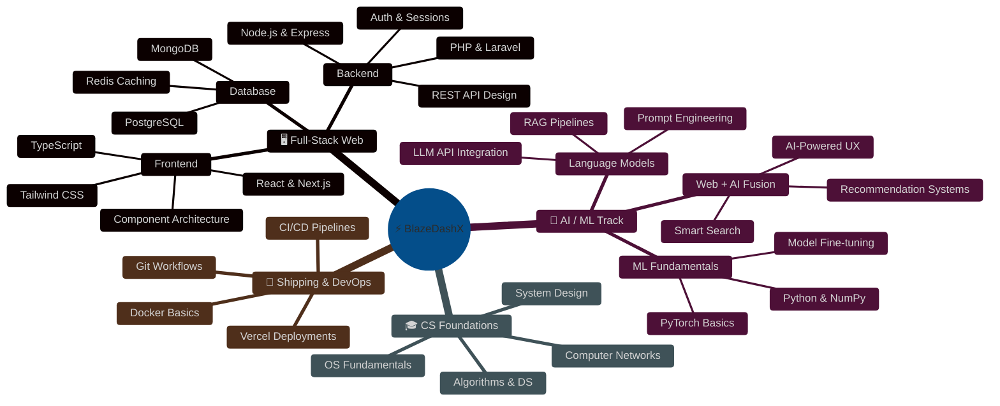
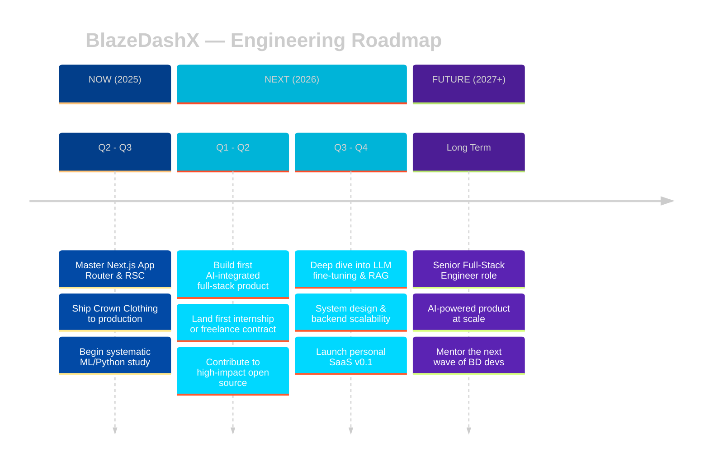

<div align="center">

</div>

<div align="center">
  
</div>

<br/>

<div align="center">
  
  &nbsp;
  <a href="https://user-badge.committers.top/bangladesh/BlazeDashX">
    
  </a>
  &nbsp;
  
  &nbsp;
  
  &nbsp;
  
</div>

<br/>

---

<h2>◈ IDENTITY.SYS</h2>

```typescript
const blazeDashX = {
  name:       "Refat Md. Labbi",
  alias:      "BlazeDashX",
  location:   "Dhaka, Bangladesh 🇧🇩",
  role:       ["Full-Stack Engineer", "AI/ML Explorer", "CS Undergrad"],
  stack:      ["TypeScript", "React", "Next.js", "Node.js", "Python"],
  learning:   ["LLM Integration", "ML Pipelines", "System Design"],
  building:   "intelligent, performant web experiences",
  seeking:    ["Internships", "Open Source Collabs", "Hackathon Teams"],
  funFact:    "I debug at 2 AM and somehow it always works then.",
};
```

<table>
<tr>
<td>🔭 Currently building</td>
<td><b>Crown Clothing v2 — production-grade e-commerce</b></td>
</tr>
<tr>
<td>🧠 Exploring</td>
<td><b>LLM integration into full-stack apps</b></td>
</tr>
<tr>
<td>💼 Open to</td>
<td><b>Internships & meaningful collaborations</b></td>
</tr>
<tr>
<td>📬 Reach me</td>
<td><a href="mailto:refat00021@gmail.com">refat00021@gmail.com</a></td>
</tr>
<tr>
<td>🌐 Portfolio</td>
<td><a href="https://refatmdlabbi.vercel.app/">refatmdlabbi.vercel.app</a></td>
</tr>
</table>

---

<h2>⚡ SKILL MATRIX — Proficiency Log</h2>

> Each skill is tracked by active usage, project depth, and learning velocity.

<h3>🖥️ Frontend Systems</h3>

<table>
<tr>
<td align="center" width="70">
<br/>
<sub><b>TypeScript</b></sub>
</td>
<td>

</td>
<td align="center"><code>90%</code></td>
</tr>
<tr>
<td align="center">
<br/>
<sub><b>React</b></sub>
</td>
<td>

</td>
<td align="center"><code>88%</code></td>
</tr>
<tr>
<td align="center">
<br/>
<sub><b>Next.js</b></sub>
</td>
<td>

</td>
<td align="center"><code>82%</code></td>
</tr>
<tr>
<td align="center">
<br/>
<sub><b>Tailwind</b></sub>
</td>
<td>

</td>
<td align="center"><code>85%</code></td>
</tr>
<tr>
<td align="center">
<br/>
<sub><b>JavaScript</b></sub>
</td>
<td>

</td>
<td align="center"><code>92%</code></td>
</tr>
</table>

<h3>⚙️ Backend & Runtime</h3>

<table>
<tr>
<td align="center" width="70">
<br/>
<sub><b>Node.js</b></sub>
</td>
<td>

</td>
<td align="center"><code>80%</code></td>
</tr>
<tr>
<td align="center">
<br/>
<sub><b>Express</b></sub>
</td>
<td>

</td>
<td align="center"><code>78%</code></td>
</tr>
<tr>
<td align="center">
<br/>
<sub><b>PHP</b></sub>
</td>
<td>

</td>
<td align="center"><code>70%</code></td>
</tr>
<tr>
<td align="center">
<br/>
<sub><b>MongoDB</b></sub>
</td>
<td>

</td>
<td align="center"><code>65%</code></td>
</tr>
</table>

<h3>🤖 AI / ML Arsenal — Active Training</h3>

<table>
<tr>
<td align="center" width="70">
<br/>
<sub><b>Python</b></sub>
</td>
<td>

</td>
<td align="center"><code>72%</code></td>
</tr>
<tr>
<td align="center">
<br/>
<sub><b>HuggingFace</b></sub>
</td>
<td>

</td>
<td align="center"><code>45%</code></td>
</tr>
<tr>
<td align="center">
<br/>
<sub><b>PyTorch</b></sub>
</td>
<td>

</td>
<td align="center"><code>38%</code></td>
</tr>
</table>

<h3>🛠️ DevOps & Tools</h3>

<div align="center">


</div>

---

<h2>🌐 TECH ECOSYSTEM — Architecture Map</h2>



---

<h2>🚀 PROJECT DEPLOYMENTS</h2>

<table>
<tr>
<td width="50%" valign="top">

### 🛒 Crown Clothing
Production-grade e-commerce storefront. Features cart state management, user authentication, responsive design, and a scalable component architecture built for real-world traffic.


[**◈ View Repo →**](https://github.com/BlazeDashX/crown-clothing-nextJS)

</td>
<td width="50%" valign="top">

### 🤝 Donation Platform
A web platform engineered to streamline charitable outreach and donation workflows. Clean UI, intuitive management, and designed for real NGO use.


[**◈ View Repo →**](https://github.com/BlazeDashX/donation-website-sm)

</td>
</tr>
<tr>
<td width="50%" valign="top">

### 📚 Learning Platform
Dual-track programming course platform supporting both beginner and advanced learners in web technologies. Structured curriculum with interactive content.


[**◈ View Repo →**](https://github.com/BlazeDashX/Learning-Platform)

</td>
<td width="50%" valign="top">

### 🤖 AI-Powered App *(Coming Soon)*
Full-stack web app with embedded LLM intelligence. Integrating modern AI APIs into a performant Next.js product — the convergence of everything I'm learning.


[**◈ Coming Soon →**](#)

</td>
</tr>
</table>

---

<h2>🗺️ CAREER TRAJECTORY — 2025–2027</h2>



---

<h2>📡 SYSTEM VITALS — Live GitHub Metrics</h2>

<div align="center">


&nbsp;&nbsp;


<br/><br/>


</div>

---

<h2>🏆 ACHIEVEMENT LOG</h2>

<div align="center">


</div>

---

<h2>🌌 3D CONTRIBUTION MATRIX</h2>

<div align="center">


</div>

---

<h2>📊 COMMIT FREQUENCY ANALYSIS</h2>

<div align="center">


</div>

---

<h2>🐍 GRID SNAKE PROTOCOL</h2>

> To activate the snake, add the GitHub Action below to your repo.

<div align="center">

<!-- After setting up the Action, replace the comment below with: -->
<!--  -->

```yaml
# .github/workflows/snake.yml  ← add this to your profile repo
name: Generate Snake Animation
on:
  schedule: [{ cron: "0 0 * * *" }]
  workflow_dispatch:
permissions: { contents: write }
jobs:
  snake:
    runs-on: ubuntu-latest
    steps:
      - uses: Platane/snk@v3
        with:
          github_user_name: BlazeDashX
          outputs: |
            dist/github-contribution-grid-snake.svg
            dist/github-contribution-grid-snake-dark.svg?palette=github-dark
      - uses: crazy-max/ghaction-github-pages@v3
        with:
          target_branch: output
          build_dir: dist
        env:
          GITHUB_TOKEN: ${{ secrets.GITHUB_TOKEN }}
```

</div>

---

<h2>📊 WAKATIME — Weekly Coding Pulse</h2>

> Connect your WakaTime account at [wakatime.com](https://wakatime.com) then add your badge ID below.

<div align="center">

<!-- Replace YOUR_WAKATIME_ID with your actual WakaTime user ID after setup -->
[](https://wakatime.com/@BlazeDashX)

</div>

<!--START_SECTION:waka-->
<!-- This section auto-populates once WakaTime GitHub Action is configured -->
<!--END_SECTION:waka-->

---

<h2>🛰️ OPEN CHANNEL — Connect</h2>

<div align="center">

<a href="https://refatmdlabbi.vercel.app/">
  
</a>

<br/><br/>

<a href="https://linkedin.com/in/YOUR_LINKEDIN_HANDLE">
  
</a>
&nbsp;
<a href="mailto:refat00021@gmail.com">
  
</a>
&nbsp;
<a href="https://github.com/BlazeDashX">
  
</a>

</div>

<br/>

---

<div align="center">


</div>

<div align="center">

</div>
